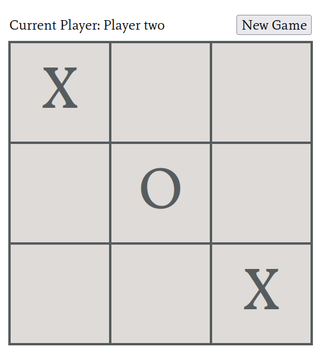

# Tic-tac-toe (Web)
This is an implementation of the game playable on a browser.
## Description

This exercise made use of factory functions and the module pattern. The project was provided by [the odin project](https://www.theodinproject.com/paths/foundations/courses/foundations/lessons/etch-a-sketch-project). The game can be played [here](https://libmartinito.github.io/tictactoejs).
